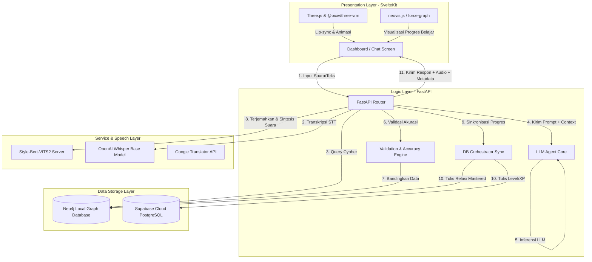

# 🏯 A.L.I.S.A. (Adaptive Language Intelligent Symbolic Assistant)

A.L.I.S.A. adalah sistem **Tutor Virtual Bahasa Jepang Interaktif (TVJP)** tingkat dasar (JLPT N5) berbasis **Neuro-Symbolic AI**. Sistem ini memadukan kekuatan generatif *Large Language Model* (LLM) dengan kepastian fakta dari *Knowledge Graph* menggunakan pendekatan **GraphRAG (Graph Retrieval-Augmented Generation)** untuk menghadirkan tutor virtual yang interaktif, akurat secara pedagogis, dan tergamifikasi tanpa risiko halusinasi informasi.

---

## 🌟 Fitur Utama

1.  **Discovery Mode (Casual Chatting & Learning)**
    *   Siswa dapat bertanya secara bebas mengenai tata bahasa (*grammar*), kosakata (*vocabulary*), atau cara baca huruf Jepang (*Kanji* / *Kana*).
    *   Respons AI dibatasi secara ketat hanya berdasarkan materi berlisensi di *Knowledge Graph* untuk menjamin akurasi materi 100%.
    *   Dilengkapi dengan **Accuracy Badge** untuk menunjukkan tingkat kepercayaan respons sistem.

2.  **Voice Mode (Oral Practice & Multimodal Interaction)**
    *   Latihan percakapan lisan interaktif secara langsung.
    *   **Speech-to-Text (STT)** mentranskripsi input suara siswa ke teks Jepang secara lokal.
    *   **Text-to-Speech (TTS)** mensintesis jawaban suara dengan intonasi emosional yang alami.
    *   **3D Avatar Virtual (Alisa)** dengan rendering Three.js yang dilengkapi sistem *lip-sync* dinamis dan kedipan mata berbasis audio amplitudo.

3.  **Quest Mode (Gamification & Syllabus Progression)**
    *   Evaluasi kemampuan siswa melalui kuis dinamis bergaya RPG.
    *   Soal kuis digenerasikan secara cerdas berdasarkan materi yang *sudah dipelajari* namun *belum dikuasai* oleh siswa di database graf.
    *   Sistem penghargaan berupa poin pengalaman (XP), kenaikan level, dan lencana pencapaian (*badges*) untuk menstimulasi motivasi belajar.

4.  **Reading Comprehension Mode (Furigana & Interactive Learning)**
    *   Menyajikan bacaan berbahasa Jepang dengan *furigana* (hiragana/katakana kecil di atas huruf kanji) untuk mempermudah pemahaman cara baca.
    *   Interaksi interaktif di mana kosakata dan tata bahasa di dalam bacaan terhubung langsung dengan *Knowledge Graph*.
    *   Dilengkapi dengan kuis pemahaman bacaan untuk menguji tingkat penguasaan kontekstual siswa.

5.  **Placement Test (Initial Skill Assessment)**
    *   Pengujian kemampuan awal siswa untuk memetakan tingkat penguasaan dasar kosakata dan tata bahasa N5 sebelum memulai pembelajaran.
    *   Hasil tes digunakan untuk merekomendasikan topik belajar yang paling sesuai di jalur pembelajaran adaptif (*learning path*).

6.  **Spaced Repetition System (SRS) & BKT (Bayesian Knowledge Tracing)**
    *   Penjadwalan tinjauan materi secara personal menggunakan algoritma **SM-2** (Spaced Repetition) untuk memaksimalkan retensi memori jangka panjang siswa.
    *   Pemodelan kognitif siswa secara *real-time* berbasis **Bayesian Knowledge Tracing (BKT)** untuk memetakan probabilitas penguasaan siswa terhadap tiap konsep secara akurat.

7.  **Vocal & Chat Accuracy Validation (System Upgrades)**
    *   Validasi multi-intent yang mampu mendeteksi dan mengambil beberapa materi sekaligus (misalnya meminta kanji sekaligus tata bahasa dalam satu kalimat) secara akurat dari basis data graf.
    *   Pencocokan terjemahan kalimat contoh secara toleran (*lenient matching*) guna mengakomodasi variasi penulisan bahasa Indonesia alami LLM tanpa memicu kesalahan deteksi pedagogis.
    *   Penyaringan vokal (TTS) cerdas yang menyaring dan melewatkan baris romaji, terjemahan Indonesia, maupun informasi tabel kanji, sehingga hanya membacakan kalimat bahasa Jepang utama demi kenyamanan dan kebersihan audio.

---

## 🛠️ Arsitektur Sistem (Neuro-Symbolic GraphRAG)

A.L.I.S.A. menggabungkan dua elemen AI utama:
*   **Komponen Neural (Connectionist):** LLM lokal (Qwen-4B) dan Speech Engines (Whisper & Style-Bert-VITS2) untuk interaksi percakapan natural.
*   **Komponen Simbolik (Symbolic):** Database Graf Neo4j sebagai representasi kurikulum terstruktur (referensi acuan **Nihongo Sou Matome N5**) yang bertindak sebagai *Ground Truth*.



---

## 💻 Spesifikasi & Stack Teknologi

### Frontend
*   **Framework:** SvelteKit (v2.0.0) & Svelte (v4.2.7)
*   **Styling:** TailwindCSS (v3.4.19)
*   **Grafis 3D & Avatar:** Three.js & `@pixiv/three-vrm` (v3.5.1)
*   **Visualisasi Graf:** `neovis.js` (v2.1.0) & `force-graph` (v1.51.4)

### Backend
*   **Framework:** FastAPI (Python 3.10)
*   **Inference Engines:** `llama-cpp-python` (Lokal LLM Qwen-4B GGUF Q4_K_M)
*   **Speech Engines:** OpenAI Whisper Base (STT lokal) & Style-Bert-VITS2 (TTS lokal)
*   **NLP Tools:** KeyBERT & Sentence-Transformers (`paraphrase-MiniLM-L3-v2`), `pykakasi`, `deep-translator`

### Basis Data
*   **Database Graf:** Neo4j (Penyimpanan silabus pelajaran & progres relasional siswa)
*   **Database Relasional:** Supabase PostgreSQL (Penyimpanan profil, log chat, skor kuis, dan pencapaian gamifikasi)

---

## ⚙️ Strategi Optimasi Memori VRAM (GPU 4GB Friendly)

Sistem dioptimalkan secara ketat untuk berjalan secara lokal pada GPU kelas menengah/laptop (seperti NVIDIA RTX 3050/4050 4GB VRAM) dengan batas penggunaan memori maksimal **3600 MB**:
*   **Llama.cpp (Qwen 4B GGUF Q4_K_M):** ~2300 MB VRAM
*   **Whisper Base (STT):** ~450 MB VRAM
*   **Style-Bert-VITS2 (TTS):** ~800 MB VRAM
*   **Model Lifecycle Management:** Pembersihan cache CUDA secara eksplisit (`torch.cuda.empty_cache()`) dan pengumpul sampah (`gc.collect()`) dilakukan secara berkala setiap kali terjadi pemrosesan audio/perubahan mode untuk mencegah kebocoran memori.

---

## 🚀 Panduan Memulai (Quick Start)

### Prasyarat (Prerequisites)
*   Windows OS dengan GPU NVIDIA (minimal GTX 1650, disarankan RTX 3050 ke atas).
*   Driver **CUDA Toolkit 12.1** terpasang.
*   **Python 3.10** (Sangat disarankan demi kompatibilitas library NLP).
*   **Node.js (v18 ke atas)**.

### Langkah Instalasi

1.  **Persiapan Virtual Environment & Backend:**
    ```powershell
    # Clone repositori dan masuk ke direktori utama
    cd TVJP

    # Buat virtual environment untuk backend
    python -m venv venv-backend
    .\venv-backend\Scripts\Activate.ps1
    pip install -r backend/requirements.txt
    ```

2.  **Instalasi Dependensi Frontend:**
    ```powershell
    cd frontend
    npm install
    cd ..
    ```

3.  **Instalasi Dependensi TTS:**
    Pastikan virtual environment untuk TTS (`venv-tts` di dalam folder `Style-Bert-VITS2`) terinstal dan terkonfigurasi. Jalankan installer batch:
    ```powershell
    .\install_tts_deps.bat
    ```

4.  **Konfigurasi Environment (`.env`):**
    Salin file `.env.example` di root direktori menjadi `.env`:
    ```powershell
    cp .env.example .env
    ```
    Isi variabel di dalam file `.env` dengan kredensial Anda:
    *   Kredensial database cloud **Supabase** (URL & Service/Publishable Keys).
    *   Kredensial database graf lokal **Neo4j** (URI Bolt, Username, Password).
    *   Path file model GGUF di sistem Anda (`UNSLOTH_MODEL_PATH`).

5.  **Migrasi Basis Data & Silabus (ETL Ingest):**
    Sebelum menjalankan aplikasi, masukkan data materi pelajaran N5 dari dataset CSV ke Neo4j:
    ```powershell
    .\venv-backend\Scripts\Activate.ps1
    python backend/data_pipeline/ingest_n5.py
    ```

6.  **Jalankan Semua Server Sekaligus:**
    Jalankan file batch berikut untuk memulai server Frontend, Backend, dan TTS secara bersamaan:
    ```powershell
    .\start.bat
    ```
    *   **Frontend SvelteKit:** `http://localhost:5173`
    *   **Backend FastAPI:** `http://localhost:8000`
    *   **TTS Server:** `http://localhost:5050`

---

*Dikembangkan untuk riset akademis dan purwarupa sistem pembelajaran mandiri bahasa Jepang tingkat dasar.*
